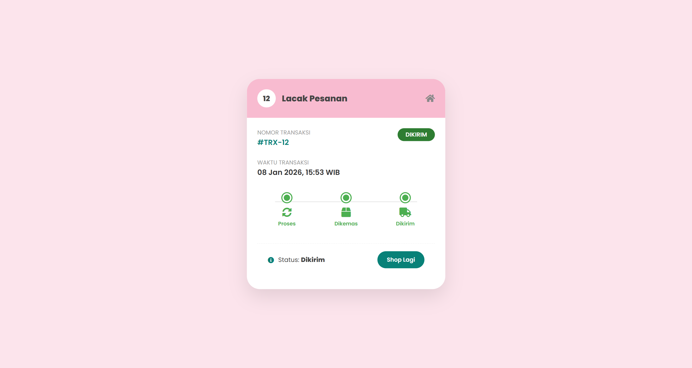
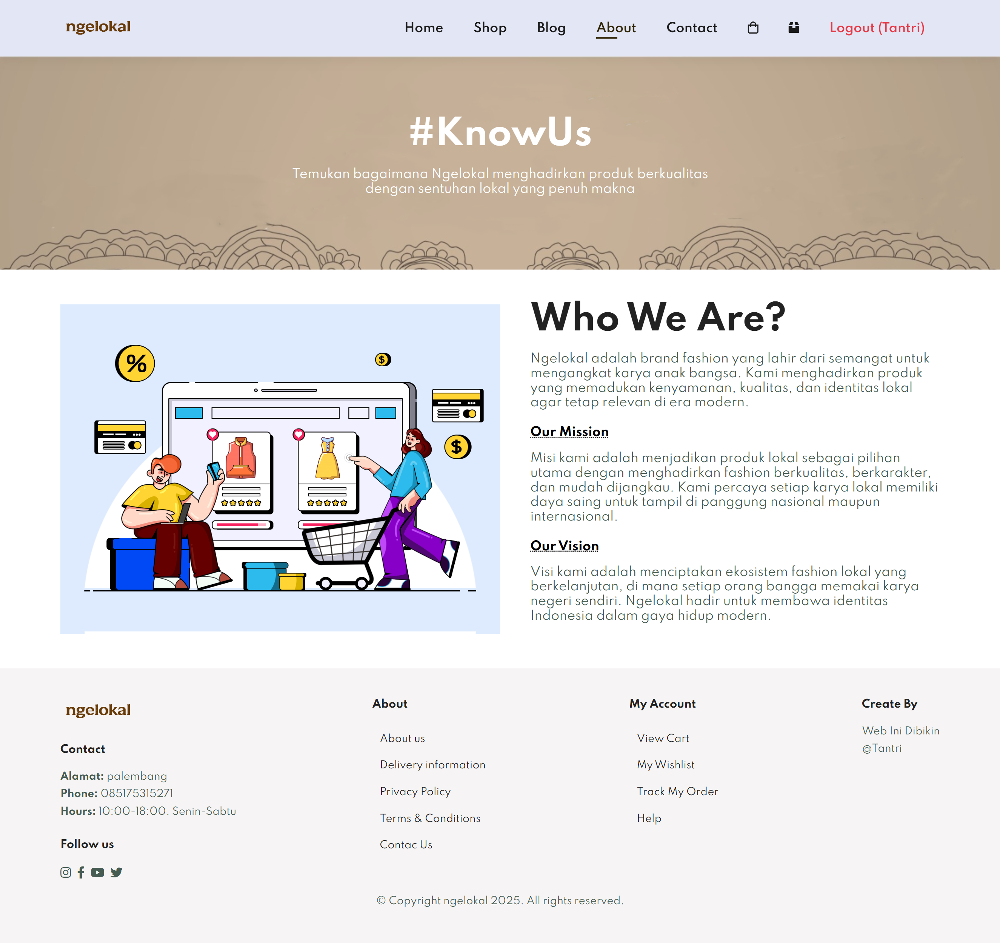
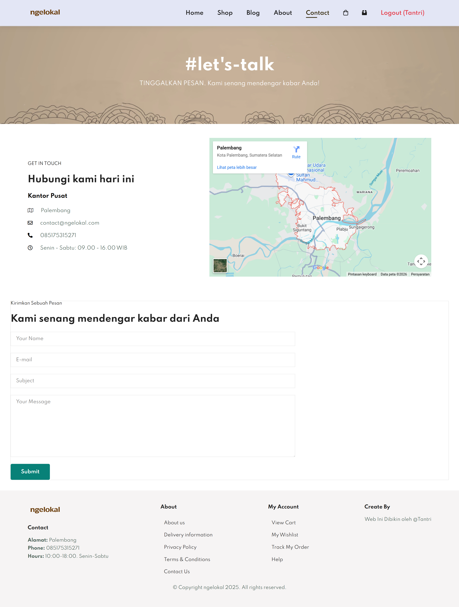
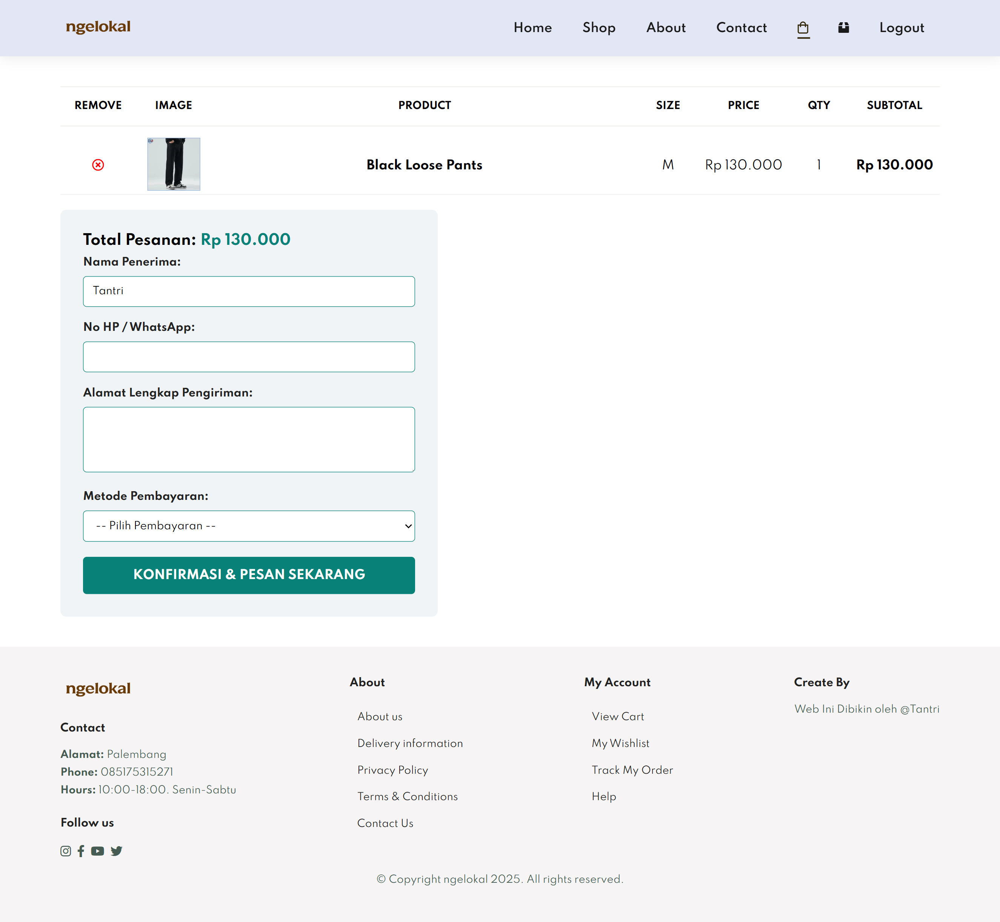
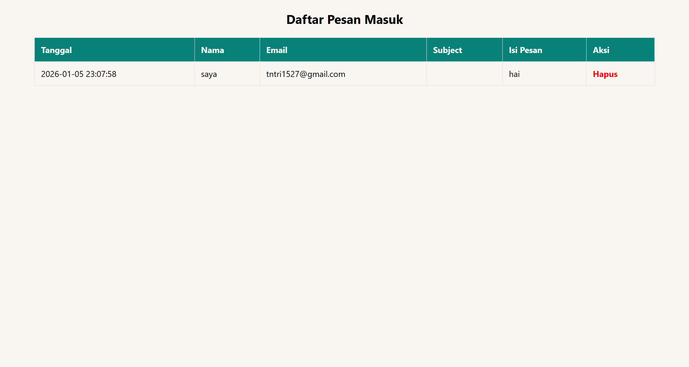

# Dokumentasi Tampilan Web UMKM

### 1. Halaman Beranda

### 2. Halaman Dashboard Admin

### 3. Halaman Produk

### 4. Halaman blog

### 5. Halaman about 

### 6. Halaman contact

### 7. Halaman cart

### 8. Halaman tracking

### 3. halaman pesananAdmin

### 1. Halaman pesanADmin

### 2. Halaman produkAdmin

